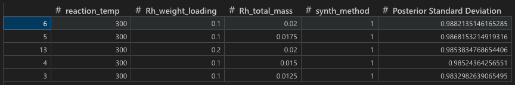
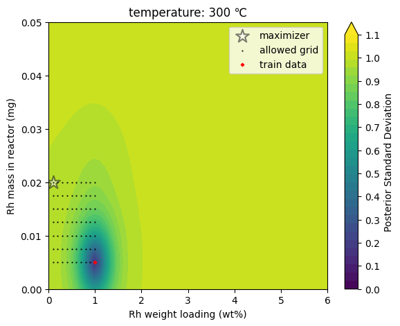

# CatDegUS

[](https://www.python.org/downloads/)
[](https://opensource.org/licenses/MIT)
[](https://botorch.org/)

Python module for **Cat**alysts' **Deg**radation navigated by **U**ncertainty **S**ampling. Given a preprocessed time-on-stream catalyst testing data (training dataset), and definitions for target metric (output) and experimental variables (input; range and step size), python codes based on `CatDegUS` can suggest the most informative experimental condition with the largest uncertainty. 2D/3D distribution of the GP-based uncertainty can also be visualized.


## Getting started
### 1. Make a virtual environment (e.g., when using `conda`):
``` bash
conda create -n catdegus python=3.13
conda activate catdegus
```
### 2. Installation
* **Directly install using pip (the simplest way)**
  ``` bash
  pip install git+https://github.com/dongjae-shin/CatDegUS.git
  ```
* cf. Alternative way: clone repository & install using pip
  ``` bash
  git clone https://github.com/dongjae-shin/CatDegUS.git
  cd CatDegUS
  pip install .
  ```
* cf. You can also install all the requirements by:
  ``` bash
  pip install -r requirements.txt
  ```

### 3. Run example codes
* Example python codes (`example.py`,`example.ipynb`) to use CatDegUS are in [`tests/`](https://github.com/dongjae-shin/CatDegUS/blob/main/tests/) directory.
* In the `tests/`, run as follows:
  ``` bash
  python ./example.py
  ```
* Alternatively, in a Jupyter notebook (`example.ipynb`):
  ``` python
  import catdegus.active_learning.gaussian_process as gpc

  # Define the home directory and path to data
  # Target metric: initial CO2 conversion
  path = "./20250228_sheet_for_ML_unique.xlsx"

  # Train the Gaussian Process model
  GP = gpc.GaussianProcess()
  GP.preprocess_data_at_once(path=path,
                            target='CO2 Conversion (%)_initial value',
                            x_range_min=[300, 0.1, 0.005, 0], 
                            x_range_max=[550, 1.0, 0.02, 1])
  GP.train_gp()
  ```
* `example.ipynb` (or `example.py`): sequential uncertainty sampling for catalyst testing and the visualization of uncertainty.
* `example_HT_reactor`: batch uncertainty sampling for **high-throughput (HT) reactor** with specific 4×4 reactor architecture.

## Requirements
* Required modules: `pandas`, `torch`, `botorch`, `matplotlib`, `openpyxl`
* All specified in `setup.py`

## Supported acquisition functions
* Posterior Standard Deviation: used for uncertainty sampling (US)
* Posterior Mean
* Upper Confidence Bound (UCB)
* Expected Improvement (EI): to be added.

## Input to the code
* **Path to a data file** (`*.xlsx`): [example](https://github.com/dongjae-shin/CatDegUS/blob/main/tests/20250228_sheet_for_ML_unique.xlsx)
* **Target metric** as output of GP surrogate model, e.g., `‘CO2 Conversion(%)_initial value’`; you can choose one of target column names
* **Lower/Upper boundaries for input features** (reaction temperature, Rh weight loading, Rh total mass, and synthesis method), by which the search space is bounded
* **Step sizes for input features**, which are allowed by experimental resolution
* **Number of conditions to suggest**; top $n$ informative conditions will be suggested.
* **Temperatures to plot** 2D acquisitions functions for
* **Synthesis method** 1) to suggest the most informative experimental condition for and 2) to plot acquisition functions for


## Output from the code
#### `Uncertainty Sampling`
* **Maximizer condition** for posterior standard deviation: US-guided experimental condition
  <div align="center">
    
  </div>
* Maximizer condition for other supported acquisition functions
* **Joint maximizer** condition for posterior standard deviation for q-batch sampling
* Selection of **temperatures with uncertainties** averaged over the other features for specific HT reactor
#### `Visualization`
* **2D visualization** of a selected acquisition function for a selected synthesis method and temperature
  <div align="center">
    
  </div>
* **3D visualization** of a selected acquisition function for a selected synthesis method
  <div align="center">
    
  </div>
#### `Potential Integration with Other Models`
* **JSON output file** corresponding to 2D/3D plot above is generated upon visualization, which could be used for applications including LLM-agent.

## To do
* Extension of available acquisition functions
* SHAP analysis
* Selection of the best regression model by LOOCV score
