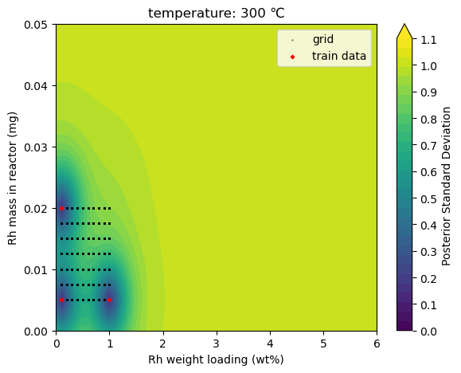

# CatDegUS
Python module for **Cat**alysts' **Deg**radation navigated by **U**ncertainty **S**ampling
* Example python codes (`*.py`,`*.ipynb`) to use CatDegUS are in [`src/tests/`](https://github.com/dongjae-shin/CatDegUS/blob/main/src/tests/) directory.
* 

## How to use
### 1. Make a virtual environment (e.g., when using `conda`):
```
conda create -n catdegus python=3.13
conda activate catdegus
```
### 2. Install requirements
   * Required modules: `pandas`, `torch`, `botorch`, `matplotlib`, `openpyxl` (as of May 30, 2025)
   * For more detailed: [`requirements.txt`]()
```
pip install -r requirements.txt
```

## Supported acquisition functions
* Posterior Standard Deviation: used for uncertainty sampling (US)
* Posterior Mean
* Upper Confidence Bound (UCB)
* Expected Improvement (EI): to be added.

## 1. Input
* A data file (`*.excel`): [example](https://github.com/dongjae-shin/CatDegUS/blob/main/src/tests/20250228_sheet_for_ML_unique.xlsx)

## 2. Output
* Maximizer condition for posterior standard deviation: US-guided experimental condition
* Maximizer condition for other supported acquisition functions
* 2D visualization of a selected acquisition function
  <div align="center">
    
  </div>